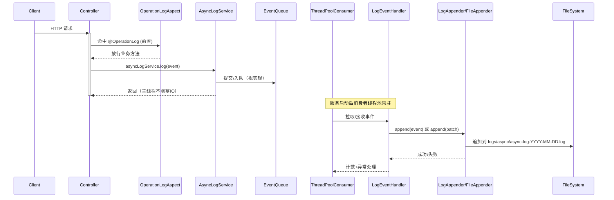
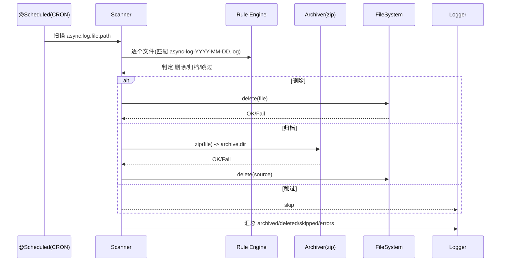

# AsyncFlowLog - 异步日志管理系统

## 项目简介

AsyncFlowLog 是一个基于 Spring Boot 的高性能异步日志管理系统，采用生产者-消费者模式，将日志记录与业务处理解耦，显著提升系统性能。系统支持多种日志输出目标，包括文件、数据库、消息队列等，并提供灵活的配置和监控功能。

## 核心特性

- 🚀 **异步处理**：日志记录与业务处理分离，不影响主业务流程
- 📊 **高性能**：基于内存队列和线程池，支持高并发场景
- 🔄 **可靠性**：支持日志重试、降级策略，确保日志不丢失
- 🛠 **可扩展**：支持多种日志输出目标，可自定义扩展
- 📈 **可监控**：提供系统健康状态监控和告警功能
- ⚙️ **可配置**：支持动态配置，灵活调整系统参数
- 🛡️ **安全性**：支持日志加密和访问控制
- 🔍 **可追踪**：支持分布式追踪和上下文传递

## 系统架构

```
业务系统 -> 日志事件 -> 内存队列 -> 消费者线程池 -> 日志写入器 -> 目标存储
```

## 快速开始

### 环境要求

- JDK 21
- Maven 3.6+
- Spring Boot 2.7.x

> **重要说明**：本项目使用Java 21开发，利用了虚拟线程等现代Java特性来提高性能。不支持在Java 8或其他旧版本Java上运行。如需了解详细的版本兼容性信息，请参阅[Java版本不兼容问题文档](docs/issues/java_version_incompatibility.md)。

### 依赖配置

```xml
<parent>
    <groupId>org.springframework.boot</groupId>
    <artifactId>spring-boot-starter-parent</artifactId>
    <version>2.7.18</version>
</parent>

<dependencies>
    <dependency>
        <groupId>com.example</groupId>
        <artifactId>asyncflowlog</artifactId>
        <version>1.0.0</version>
    </dependency>
</dependencies>
```

### 基本使用

```java
@RestController
public class UserController {
    @Autowired
    private AsyncLogService asyncLogService;
    
    @PostMapping("/login")
    public ResponseEntity<ApiResponse<UserDTO>> login(@RequestBody LoginDTO loginDTO) {
        // 1. 处理登录逻辑
        UserDTO user = userService.login(loginDTO);
        
        // 2. 创建日志事件
        LogEvent event = new LogEvent(
            LocalDateTime.now(),
            "INFO",
            "用户登录",
            Map.of(
                "username", loginDTO.getUsername(),
                "ip", getClientIp(),
                "result", "success"
            )
        );
        
        // 3. 异步记录日志
        asyncLogService.log(event);
        
        // 4. 返回结果
        return ResponseEntity.ok(ApiResponse.success(user));
    }
}
```

## 配置说明

```yaml
spring:
  application:
    name: async-flow-log

async:
  log:
    queue:
      type: linked
      capacity: 10000
    consumer:
      core-size: 2
      max-size: 4
      keep-alive: 60
    appender:
      type: file
      file-path: /var/log/async
      batch-size: 100
      flush-interval: 1000

management:
  endpoints:
    web:
      exposure:
        include: health,info,metrics
  endpoint:
    health:
      show-details: always
```

## 监控指标

系统提供以下监控指标：
- 队列使用率
- 处理延迟
- 写入成功率
- 系统资源使用
- 错误率统计

## 文档

- [设计文档](docs/design.md)
- [模块分析](docs/asyncflowlog_anaysis.md)
- [进度跟踪](docs/progress.md)
- [技术栈分析](docs/tech_stack_analysis.md)
- [Java版本不兼容问题](docs/issues/java_version_incompatibility.md)
- [Git与IDE配置文件管理指南](docs/git_ide_management.md)

## 开发计划

1. 第一阶段：实现核心功能
   - 日志事件模块
   - 队列管理模块
   - 消费者线程池
   - 基础日志写入器

2. 第二阶段：添加配置支持
   - 配置文件解析
   - 动态配置支持
   - 异常处理机制

3. 第三阶段：扩展输出目标
   - 数据库支持
   - 消息队列支持
   - 自定义输出支持

4. 第四阶段：优化和增强
   - 性能优化
   - 监控告警
   - 运维支持

## 贡献指南

欢迎提交 Issue 和 Pull Request。在提交代码前，请确保：
1. 代码符合项目规范
2. 添加必要的单元测试
3. 更新相关文档
4. 通过代码审查

## 许可证

MIT License - [配置参数指南](codex-doc/async_log_config_guide.md)
- [JMeter 压测指南](codex-doc/20251022/jmter/jmeter_pressure_test.md)

## 定时清理与归档（Scheduler）

- 作用：按 cron 周期对历史日志执行“先归档（zip 到归档目录）再清理（删除）”，仅处理严格早于今天的文件；默认关闭，独立线程池不影响主流水线。
- 快速启用（生产示例）：
  ```yaml
  async:
    log:
      maintenance:
        enabled: true
        cron: "0 5 2 * * ?"       # 每日 02:05 执行
        timezone: "Asia/Shanghai"
      retention:
        days: 14                  # 留存天数（含今天）
      archive:
        enabled: true
        dir: logs/archive         # 归档目录
        days: 3                   # 归档阈值天数（建议 < retention.days）
        compress: zip             # 目前仅支持 zip
      file:
        path: logs/async          # 与写入器目录保持一致
  ```
- 本地测试可将 cron 设为 `0/15 * * * * ?`（每 15 秒）便于观察，验证通过后改回每日或关闭开关。
- 更多说明：
  - 参数说明：`codex-doc/SchedulerDesign/parameters.md`
  - 使用指南：`codex-doc/SchedulerDesign/quickstart.md`
  - 实现说明：`codex-doc/SchedulerDesign/implementation.md`

## 整体流程图（Mermaid）

- 主流水线与定时维护的可视化流程，见：`codex-doc/diagrams/overview.md`
- 包含：
  - 日志生产（业务/AsyncLogService/@OperationLog）→ 队列 → 消费者线程池 → 事件处理器 → 写入器（FileAppender/可扩展）
  - 定时任务（归档+清理）：Cron 触发 → 扫描目录 → 判定删除/归档/跳过 → 汇总统计

- 更多图示：
  - 主链路时序：`codex-doc/diagrams/main_sequence.md`
  - 优雅停机时序：`codex-doc/diagrams/shutdown_sequence.md`
  - 定时任务时序：`codex-doc/diagrams/scheduler_sequence.md`
  - 定时任务异常流：`codex-doc/diagrams/scheduler_error_flow.md`
  - 组件关系：`codex-doc/diagrams/components.md`
  - 部署视图：`codex-doc/diagrams/deployment.md`
  - 文件轮转状态：`codex-doc/diagrams/file_rotation_state.md`

## 开发扩展与排查
- Appender 扩展开发指南：`codex-doc/guide/appender_extension.md`
- 定时任务故障排查：`codex-doc/SchedulerDesign/troubleshooting.md`

## 主链路时序图（Mermaid）



## 定时任务时序图（Mermaid）



> 归档策略说明：满足归档阈值的历史日志会被压缩为 zip 到 `async.log.archive.dir`，同时原始 `.log` 会被迁移到 `async.log.archive.raw-dir`，便于审计与对比。
> 配置示例：
```yaml
async:
  log:
    archive:
      enabled: true
      dir: logs/archive
      raw-dir: logs/archive/raw
      days: 3
      compress: zip
```
