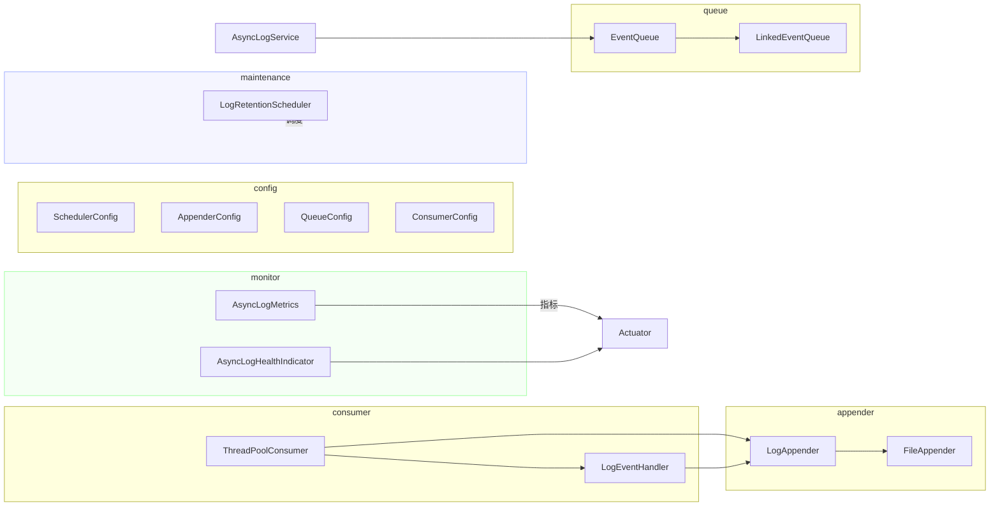

# 组件关系图（Mermaid）

```mermaid
flowchart LR
  subgraph appender[appender]
    LA[LogAppender]
    FA[FileAppender]
    LA --> FA
  end

  subgraph consumer[consumer]
    CPC[ThreadPoolConsumer]
    EH[LogEventHandler]
    CPC --> EH
  end

  subgraph queue[queue]
    EQ[EventQueue]
    LEQ[LinkedEventQueue]
    EQ --> LEQ
  end

  subgraph config[config]
    SC[SchedulerConfig]
    AC[AppenderConfig]
    QC[QueueConfig]
    CC[ConsumerConfig]
  end

  subgraph maintenance[maintenance]
    LRS[LogRetentionScheduler]
  end

  subgraph monitor[monitor]
    MET[AsyncLogMetrics]
    HC[AsyncLogHealthIndicator]
  end

  ALS[AsyncLogService] --> EQ
  CPC --> LA
  EH --> LA
  maintenance -. 调度 .-> LRS
  MET -->|指标| Act[Actuator]
  HC --> Act

  style maintenance fill:#f5f5ff,stroke:#94a3ff
  style monitor fill:#f5fff5,stroke:#94ff94
```
