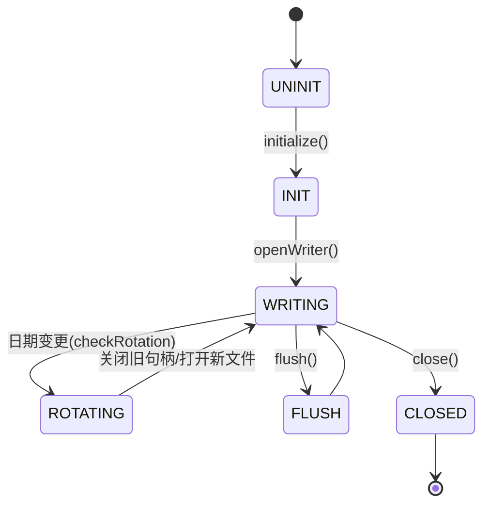

# 文件轮转状态图（Mermaid）

```mermaid
stateDiagram-v2
  [*] --> UNINIT
  UNINIT --> INIT: initialize()
  INIT --> WRITING: openWriter()
  WRITING --> ROTATING: 日期变更(checkRotation)
  ROTATING --> WRITING: 关闭旧句柄/打开新文件
  WRITING --> FLUSH: flush()
  FLUSH --> WRITING
  WRITING --> CLOSED: close()
  CLOSED --> [*]
```
