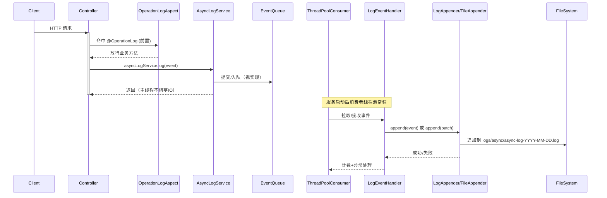

# 主链路时序图（Mermaid）

```mermaid
sequenceDiagram
  participant Client
  participant Controller
  participant AOP as OperationLogAspect
  participant ALS as AsyncLogService
  participant EQ as EventQueue
  participant CPC as ThreadPoolConsumer
  participant EH as LogEventHandler
  participant APP as LogAppender/FileAppender
  participant FS as FileSystem

  Client->>Controller: HTTP 请求
  activate Controller
  Controller->>AOP: 命中 @OperationLog (前置)
  AOP-->>Controller: 放行业务方法
  Controller->>ALS: asyncLogService.log(event)
  ALS->>EQ: 提交/入队（视实现）
  ALS-->>Controller: 返回（主线程不阻塞IO）
  deactivate Controller

  Note over CPC,EH: 服务启动后消费者线程池常驻
  CPC->>EH: 拉取/接收事件
  EH->>APP: append(event) 或 append(batch)
  APP->>FS: 追加到 logs/async/async-log-YYYY-MM-DD.log
  APP-->>EH: 成功/失败
  EH-->>CPC: 计数+异常处理
```
