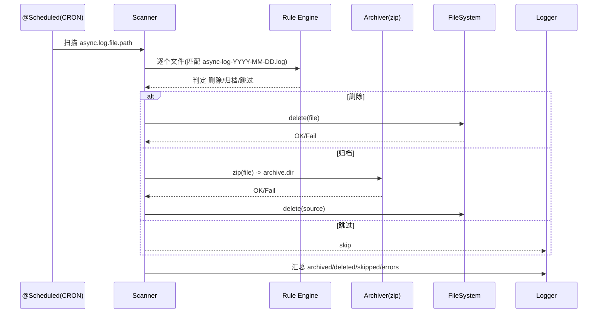

# 定时任务（归档+清理）时序图（Mermaid）

```mermaid
sequenceDiagram
  participant Cron as @Scheduled(CRON)
  participant Scan as Scanner
  participant Rule as Rule Engine
  participant Zip as Archiver(zip)
  participant FS as FileSystem
  participant Log as Logger

  Cron->>Scan: 扫描 async.log.file.path
  Scan->>Rule: 逐个文件(匹配 async-log-YYYY-MM-DD.log)
  Rule-->>Scan: 判定 删除/归档/跳过
  alt 删除
    Scan->>FS: delete(file)
    FS-->>Scan: OK/Fail
  else 归档
    Scan->>Zip: zip(file) -> archive.dir
    Zip-->>Scan: OK/Fail
    Scan->>FS: delete(source)
  else 跳过
    Scan-->>Log: skip
  end
  Scan->>Log: 汇总 archived/deleted/skipped/errors
```
