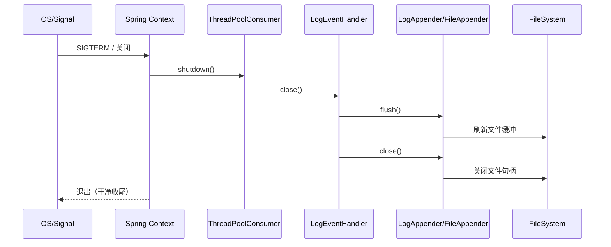

# 优雅停机时序图（Mermaid）

```mermaid
sequenceDiagram
  participant OS as OS/Signal
  participant Spring as Spring Context
  participant CPC as ThreadPoolConsumer
  participant EH as LogEventHandler
  participant APP as LogAppender/FileAppender
  participant FS as FileSystem

  OS->>Spring: SIGTERM / 关闭
  Spring->>CPC: shutdown()
  CPC->>EH: close()
  EH->>APP: flush()
  APP->>FS: 刷新文件缓冲
  EH->>APP: close()
  APP->>FS: 关闭文件句柄
  Spring-->>OS: 退出（干净收尾）
```
